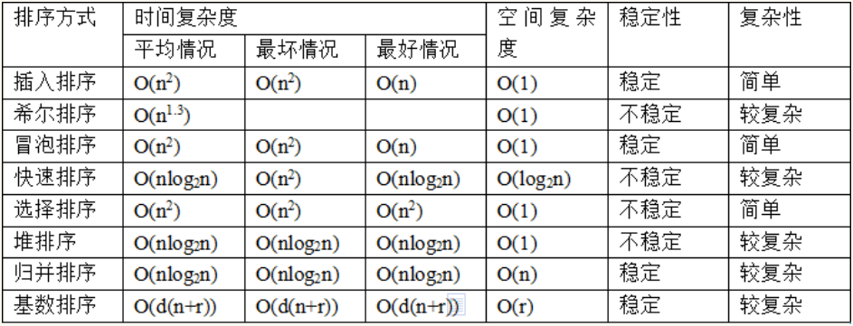

# Main

## Sort

## STL

### 标准库引用

| 组件 | 描述 |
| :---| :--- |
| 容器（Containers） | 容器是用来管理某一类对象的集合。C++ 提供了各种不同类型的容器，比如 deque、list、vector、map 等。|
| 算法（Algorithms） | 算法作用于容器。它们提供了执行各种操作的方式，包括对容器内容执行初始化、排序、搜索和转换等操作。|
| 迭代器（iterators） | 迭代器用于遍历对象集合的元素。这些集合可能是容器，也可能是容器的子集。|

### Sort 

* Prototype:

>sort(arrStart, arrEnd[, Bool compare]);
>int compare(ET \[\*\]front,ET\[\*\] end);

* [qsort函数、sort函数 (精心整理篇)](https://www.cnblogs.com/ForeverJoker/archive/2013/05/25/qsort-sort.html#undefined)

sort是qsort的升级版，如果能用sort尽量用sort，使用也比较简单，不像qsort还得自己去写cmp 函数，只要注明使用的库函数就可以使用，参数只有两个（如果是普通用法）头指针和尾指针；

* 使用`sort`, 默认`升序`, 可添加compare函数;
* 需要`using namespace std`
* 环境2: `#include <algorithm>`